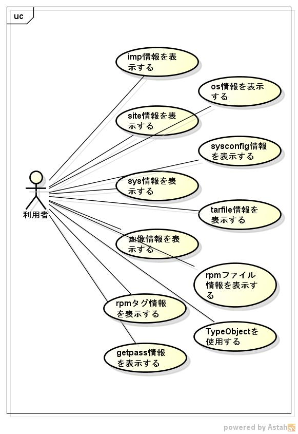

pythontool
==========
c言語からpythonのライブラリを使用したツール集です。

## Description ##

詳細は、

https://github.com/siranovel/pythontool/wiki
## Demo ##

## VS. ##

## Requirement ##
VineLinux ver 6.5に付属しているpythonに依存

## Usage ##
* pyimpinfo  
  $ pyimpinfo  
* pyosinfo  
  $ pyosinfo
* pysiteinfo  
  $ pysiteinfo
* pysysconfiginfo  
  $ pysysconfiginfo
* pysysinfo  
  $ pysysinfo
* pytarinfo  
  $ pytarinfo tarfile
* pypilinfo  
  $ pyimage 画像ファイル名
* pyrpminfo  
  $ pyrpminfo rpmファイル
* pyrpmtaginfo  
  $ pyrpmtaginfo
* pylz  
  $ pylz2  
  $ pylz3  
* pypass  
  $ pyuser

## install ##
    git clone https://github.com/siranovel/pythontool.git  
    cd pythontool  
    rpm -ivh <rpmファイル名>  

## Contribution ##

## Licence ##

## Author ##
